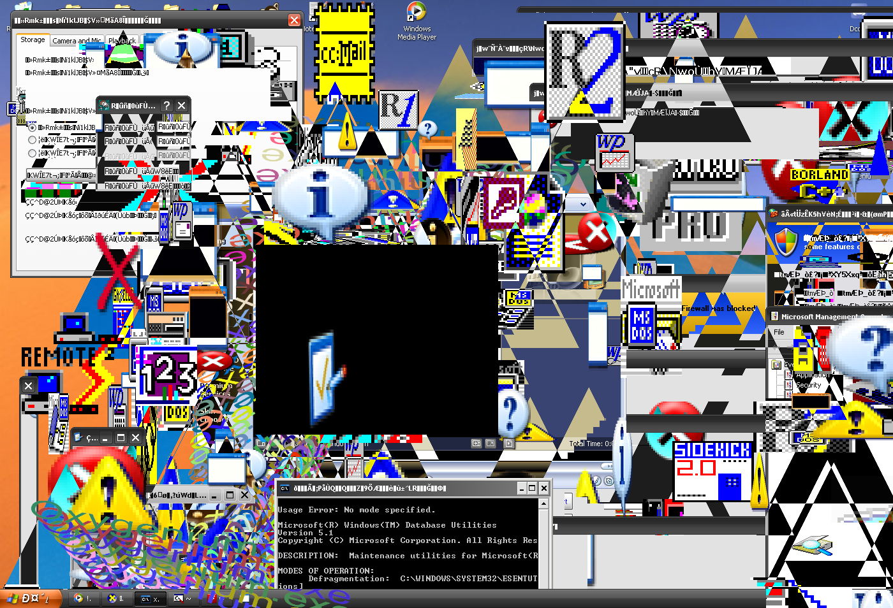
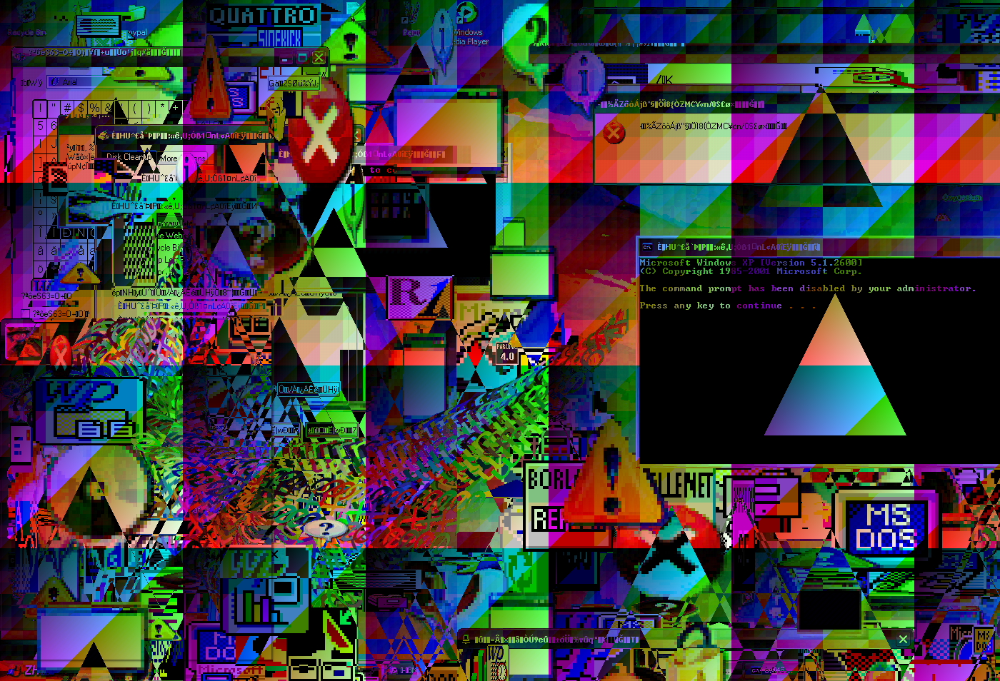

 

# ⚠️ Before starting this malware 
Recomended use VBox - VMware Workstation because that program can cause your system death and data loss. Use Windows XP because if you want to run it on Windows 7 the malware will end halfway through the payloads, and don't forget to download vc_redist 2015 otherwise the program won't start!

# 📸 Screenshots

 
